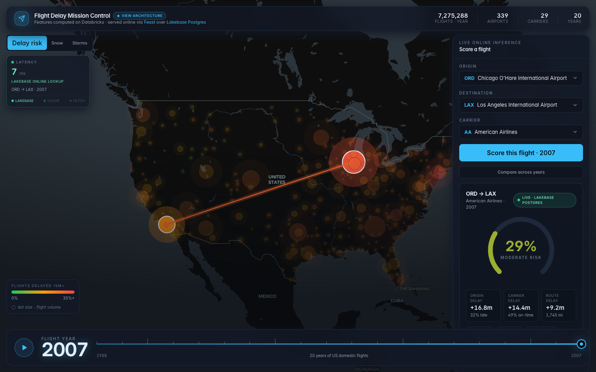
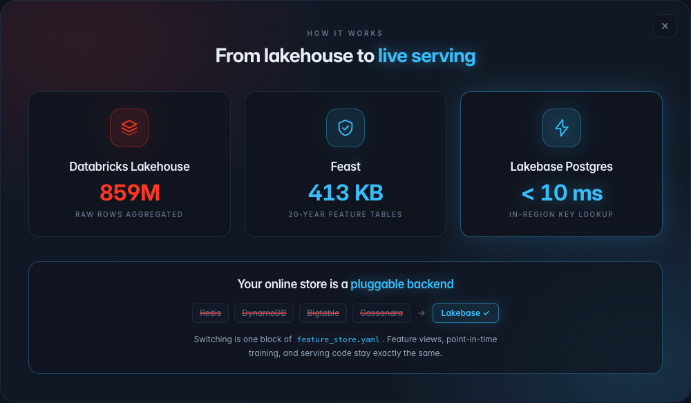
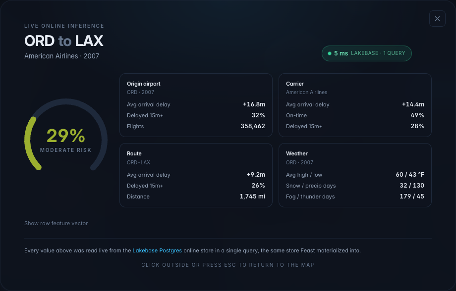
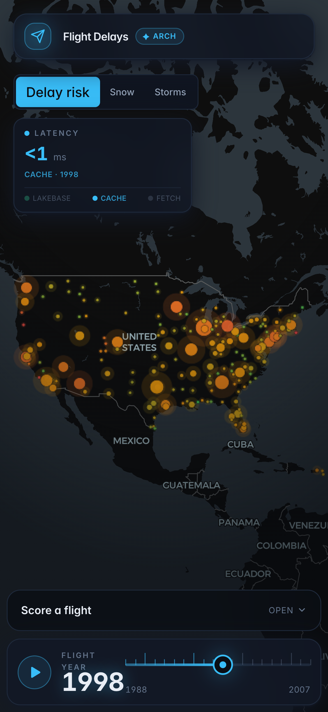

<div align="center">

# Feast on Flight Data, with a Lakebase Postgres Online Store

**20 years of US flight delays, scored live from Lakebase Postgres in single-digit milliseconds.**


[](https://youtu.be/P2P2wP4cA7s)

[](https://youtu.be/P2P2wP4cA7s)

**[Watch the 8-minute walkthrough](https://youtu.be/P2P2wP4cA7s)** - the cold start, the live scoring, and the one-block swap.

</div>

Feast lets you swap the online store with no other code changes. This demo swaps it to Lakebase Postgres by editing one block of `feature_store.yaml`. That swap is the whole point.

## What you are looking at

The shot above is the live dashboard. It scored a flight from ORD to LAX. The route is drawn as an arc on a dark US map. The latency readout shows the score read all of that flight's features from Lakebase in about 7 ms.

Feast keeps two stores. The offline store is where features are computed and held in bulk. The online store is where one entity's features are read fast at score time. Feast supports several online stores: Redis, DynamoDB, Bigtable, Cassandra. This demo uses Lakebase Postgres instead. The application code does not change. Only the config does.

## The swap

This is the only thing that differs from a Redis or DynamoDB or Bigtable or Cassandra setup. One block in `feature_store.yaml`:

```yaml
online_store:
  type: postgres
  host: <your-lakebase-endpoint>
  port: 5432
  database: feast
  user: <your databricks user or service principal>
  password: <short-lived OAuth token>
  sslmode: require
```

Everything above this block stays the same. Run `feast apply` and `feast materialize` and you serve from Lakebase.

## Architecture



Three stages. Databricks computes the features. Feast holds the definitions and moves data between the two stores. Lakebase serves the online reads. The backend is pluggable, so Redis or DynamoDB or Bigtable or Cassandra could sit where Lakebase sits.

## The data

About 115M US domestic flights from 1988 to 2007, plus NOAA weather. Features are aggregated on Databricks with serverless SQL over Unity Catalog.

The aggregated feature tables are tiny, about 420 KB. They ship in this repo as parquet, which is Feast's file offline store. `feast materialize` loads them into Lakebase, the online store. There is no large download.

## Entities and the year key

The entities are airport, carrier, route, and year. `year` is part of the key, so the online store holds all 20 years per airport and per carrier. You can score "ORD in 1995" against "ORD in 2007" live.

## Performance

Honest, measured numbers.

A score reads all of a flight's features in one Lakebase query. In region that is about 7 ms. It was verified reliably under 10 ms, with 0 of 30 samples over.

Bulk dashboard views, the map, the leaderboard, and the trend, read the offline parquet held in memory. That is about 2 to 15 ms server-side.



The breakdown above is one click. It shows every feature that went into the score, all read in that single Lakebase query.

## Dashboard

React plus deck.gl on a dark map. It has:

- a 1988 to 2007 year scrubber with Play
- score-a-flight, which draws the route as an arc on the US map
- a click-through full-screen breakdown
- compare-across-years
- a live latency readout with three tiers

It works on a phone.



## Run it locally

Real, tested commands.

```bash
git clone https://github.com/ryancicak/feast-flight-demo.git && cd feast-flight-demo
python -m venv .venv && source .venv/bin/activate && pip install -r requirements.txt
export LAKEBASE_PROFILE=your-cli-profile
databricks postgres create-project feast-flight-demo -p "$LAKEBASE_PROFILE"   # one time
python scripts/lakebase.py setup-db                                            # create the feast db
./feast_run.sh apply
./feast_run.sh materialize 1988-01-01T00:00:00 2009-01-01T00:00:00
./run_demo.sh        # dashboard at http://localhost:8000, Feast UI at http://localhost:8888
```

## Deploy as a Databricks App

The app runs as its own service principal. That principal needs read access to the `feast` database, granted once. After that, deploying is a sync and a deploy.

```bash
export PROFILE=your-cli-profile
WSP=/Workspace/Users/<you>/flight-delay

databricks apps create flight-delay -p "$PROFILE"
# one time: grant the app's service principal a Postgres role + SELECT on the feast db

databricks sync . "$WSP" -p "$PROFILE" --full
# sync skips the built UI and the registry, so push those by hand:
databricks workspace import-dir app/web/dist "$WSP/app/web/dist" -p "$PROFILE" --overwrite
databricks workspace import "$WSP/feature_repo/data/registry.db" --file feature_repo/data/registry.db --format RAW -p "$PROFILE" --overwrite

databricks apps deploy flight-delay --source-code-path "$WSP" -p "$PROFILE"
```

The app mints its own short-lived Lakebase token at startup, so there is no password to store.

## Optional

Everything you need to run the demo is above. The `optional/` folder is reference, not required:

- `optional/build_features.py` rebuilds the feature tables on Databricks. The parquet already ships, so you only need this to regenerate them.
- `optional/demo.py` runs the same retrieval from the command line: `serve` for online, `train` for a point-in-time training set.
- `optional/notebooks/` has the notebook-native variant and the script that measured the under-10ms number.

## License

Apache 2.0.
